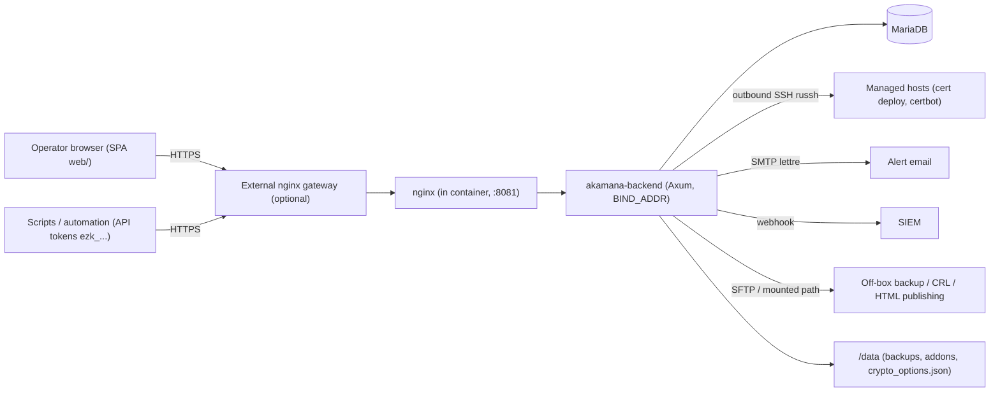

# Akamana — Architecture

> Status: verified against the code on 2026-07-15 (backend v0.3.1 / API spec v0.4.0).
> This document consolidates and supersedes the architecture notes scattered across
> `CLAUDE.md`, `README.md` and `docs/FEATURES_AND_API.md`.

## 1. System context

Akamana is an internal-lab certificate & key lifecycle service. A single Rust binary
(`akamana-backend`, Axum + SQLx + OpenSSL) runs behind an in-container nginx, backed by
MariaDB, and serves a static vanilla-JS SPA (`web/`). It also reaches **out** to managed
hosts over SSH (deployment, certbot) and to SMTP / SIEM / remote storage for alerts,
logs and backups.

## 2. Runtime composition

**One container, two processes.** `scripts/entrypoint-akamana.sh` starts nginx (listening
on `:8081`, config `deploy/nginx/akamana.conf`) in front of the backend (listening on
`BIND_ADDR`, e.g. `127.0.0.1:18080` in `docker-compose.yml`). MariaDB runs as a separate
service (compose) or sidecar (podman `deploy/pod.yaml`).

**Startup sequence** (`main.rs::main`):

1. `db::connect` — MySQL/MariaDB pool.
2. `db::run_migrations` — applies `backend/migrations/001…021` (see §7).
3. `db::bootstrap_admin` — creates the bootstrap admin (password policy enforced in `config.rs`).
4. `db::seed_applications` — seeds the application catalog (nginx, Apache, …).
5. `crypto::ensure_root_ca` — bootstraps the TLS root CA if absent.
6. `crypto::ensure_ssh_cas` — bootstraps the SSH **User CA** and **Host CA**.

Then **five background tasks** are spawned before serving:

| Task | Module | Period | Purpose |
|---|---|---|---|
| Expiry notifier | `notifier.rs` | periodic | Emails (SMTP via lettre) for expiring TLS/SSH material |
| Machine monitor | `machine_monitor.rs` | periodic | TLS scans of monitored host/port/SNI rows; expiry status; alert email with reachability cross-check |
| Security monitor | `security_monitor.rs` | periodic | Brute-force / auth-attack detection from `access_logs`; persists `security_events`; SIEM webhook |
| Lifecycle | `lifecycle.rs` | hourly | Auto-renews leaf certs within `renew_days_before`, re-deploys targets; re-runs due certbot configs |
| Backup | `backup.rs` | per `backup_frequency_hours` | Scheduled encrypted DB backups + off-box push (see `docs/backup_and_restore.md`) |

## 3. Request pipeline

Middleware order (`main.rs`): **security headers** (HSTS, CSP, XCTO, XFO, Referrer-Policy,
Permissions-Policy as `const`s) → **CORS** (permissive only when `ALLOWED_ORIGINS=*`,
which logs a warning) → **`auth_guard`** → handler.

`auth_guard`:

- assigns an `x-request-id` (UUID, also used as the `access_logs` PK),
- resolves the client IP — `x-forwarded-for` is honored **only** when the direct peer is
  in `TRUSTED_PROXY_IPS` (`config::resolved_client_ip`),
- passes non-`/api/` paths through untouched (static SPA, `/health`, `/crl/:file`),
- allow-lists a small public set (see §4), requires `Authorization: Bearer` otherwise,
- writes an `access_logs` row for every `/api/` request (authenticated or not).

## 4. Public (unauthenticated) surface

| Endpoint | Why public |
|---|---|
| `GET /health` | liveness (non-`/api/` path) |
| `GET /crl/:file` | X.509 CRL (DER) — URL embedded in issued certs' CRL Distribution Point |
| `POST /api/v1/auth/login` | obtain JWT |
| `GET /api/v1/openapi.json` | machine-readable API discovery |
| `GET /api/v1/certificates/root` | root CA listing (public certs only) |
| `GET /api/v1/certificates/root/download/:platform` | root install bundles (windows/macos/linux/ios/android) |
| `/` (static `web/`) | the SPA itself |

Additionally, the **Deploy-HTML publisher** can push a generated public HTML page
(root-CA install instructions) to a remote destination — that page is served by an
external web server, not by Akamana.

## 5. Authentication & authorization

Two credential kinds are resolved by `auth::authenticate`:

- **Login JWTs** — `AUTH_MODE=local`: HS256 with `JWT_SECRET`, lifetime `JWT_EXP_MINUTES`
  (default 30). `AUTH_MODE=oidc`: RS256 validated against a cached JWKS
  (`auth::JwksManager`); role mapped from `OIDC_ROLE_CLAIM`.
- **API tokens** — `ezk_…`, stored as SHA-256 hashes in `api_tokens` (migration 018).
  Carry the sentinel role `"token"` which fails every `can_manage_*` check; they only
  reach endpoints that explicitly call `authorize(auth, scope, role_ok)`.
  Scopes: `tls:issue`, `tls:read`, `ssh:issue`, `ssh:sign`, `ssh:read`, `ca:read` —
  grantable scopes are capped by the creating user's role. Token CRUD is human-only
  (`require_human`).

**RBAC** is enforced **per handler** (not by the router) in `routes/api.rs`:

| Role | May manage |
|---|---|
| `full_admin` | everything, incl. users, credentials (secret material), backups, settings |
| `tls_admin` | TLS certs, CA, monitoring, inventory, deployment, certbot |
| `ssh_admin` | SSH keys/certificates, inventory |
| `auditor` | read-only logs/audit |

Helpers: `can_manage_tls`, `can_manage_ssh`, `can_audit`, `can_manage_machines`,
inline `matches!(role, "full_admin")`. When adding an endpoint, add the check inside
the handler.

> `REQUIRE_MFA=true` makes a second factor mandatory: `login` hands an account
> with no factor a short-lived `akamana-mfa` token instead of a session, and the
> session is only issued after TOTP enrollment is confirmed. See
> `docs/security.md` § "Sign-in hardening".

## 6. Module map (`backend/src/`)

| Module | Responsibility |
|---|---|
| `main.rs` | startup, middleware, `auth_guard`, access logging |
| `config.rs` | env-only config (dotenvy), bootstrap-password policy, trusted proxies |
| `db.rs` | pool, naive `;`-split migration runner, bootstrap admin, app catalog seed |
| `auth.rs` | Argon2 verify, JWT create/decode, OIDC/JWKS, `AuthenticatedUser` extractor, API-token auth |
| `crypto.rs` | root/intermediate/leaf issuance (OpenSSL), SAN + EKU, SSH keys & SSH CA certificate signing (`ssh-key`), CRL DER generation, API-token hashing, AES-256-GCM `encrypt_secret`/`decrypt_secret` |
| `routes/api.rs` | **all** HTTP handlers + router (~5 700 lines) |
| `models.rs` | request/response DTOs (`validator`-annotated) |
| `errors.rs` | `AppError` / `AppResult` (clippy denies `unwrap`/`expect`) |
| `machine_monitor.rs` | TLS scanning of monitored ports/vhosts, alert emails |
| `notifier.rs` | expiry notification emails |
| `security_monitor.rs` | brute-force detection, `security_events`, SIEM webhook |
| `lifecycle.rs` | hourly auto-renew + certbot re-runs |
| `deploy.rs` | outbound SSH (russh) deployment engine, pre-flight checks, journaling, remote certbot |
| `backup.rs` | dump/restore (mariadb-dump/mariadb), retention, skip-unchanged, scheduler |
| `backup_crypto.rs` | `.ezbak` encrypted container (Argon2id passphrase / RSA envelope) |
| `backup_remote.rs` | off-box push: mounted path or SFTP (russh-sftp); shared by backups, CRL and Deploy-HTML publishing |
| `addons.rs` | declarative YAML/JSON integration plans loaded from `ADDONS_DIR` |

## 7. Data & persistence

- **MariaDB** — all state: users/roles, machines & monitoring, root/intermediate/leaf TLS
  (`tls_keys` with `sans_json`, `eku_purpose`, auto-renew fields), SSH keys, SSH CAs &
  certificates, CRL entries, inventory (applications, credentials, host links,
  deployment jobs/journal, certbot configs), API tokens, backup recipients, settings
  (key/value), audit/access/security logs. Private keys and credential secrets are
  encrypted at rest (AES-256-GCM keyed by `KEY_ENCRYPTION_KEY_B64`).
- **Filesystem `/data`** (`AKAMANA_DATA_DIR`) — `backups/` (local backup files + `.sig`),
  `addons/`, optional `crypto_options.json` (runtime-configurable ciphers/key lengths,
  path override `AKAMANA_CRYPTO_OPTIONS_PATH`, default `/data/crypto_options.json`).
- **Migrations** — `backend/migrations/NNN_*.sql`, `include_str!`'d and re-run at every
  startup by a naive `;` splitter: they must stay idempotent and must not contain `;`
  inside statement bodies. Register new files in the `migrations` array in `db.rs`.

## 8. Frontend

Static classless SPA: `web/index.html` + `web/app.js` + `web/style.css`, served by
`ServeDir` at `/` (no build step). Pages: Certificates, Monitoring (machines), Hosts,
Applications, Credentials, Deploy, Certbot/API, Tokens, Users, Logs, Settings, Profile.
Dual **Standard/Expert** mode persisted in `localStorage`.

## 9. Deployment & CI

- **Docker Compose** (`docker-compose.yml`): MariaDB 11.4 + Akamana; host port
  `${AKAMANA_HTTP_PORT:-8081}`; env from `${AKAMANA_HOST_CONFIG_DIR}/akamana.env`; data volume
  `${AKAMANA_HOST_DATA_DIR}` → `/data`.
- **Podman pod** (`deploy/pod.yaml`) and interactive `scripts/install_or_update.sh`
  (Docker root / Podman root / Podman rootless).
- **Image** (`Dockerfile`): rust:1.93 builder → debian:bookworm-slim with nginx,
  openssl, `default-mysql-client` (required by the backup subsystem).
- **CI**: Gitea Actions `.gitea/workflows/sonarqube.yml` — Clippy → SonarQube scan →
  auto-files Gitea issues for MEDIUM/HIGH/BLOCKER findings. *(There is no GitLab CI
  anymore; older docs referencing `.gitlab-ci.yml` are stale.)*
- **Tests**: none in-tree (see gap register in `docs/REQUIREMENTS.md`).

## 10. Known architectural debts

- `routes/api.rs` is a single ~5 700-line file holding every handler.
- Migration runner has no version table/checksums — relies on idempotent SQL.
- SSH host keys are accepted blindly in `deploy.rs` and `backup_remote.rs` (lab-only).
- OpenAPI spec covers only the machine-facing subset (10 paths) of ~120 routes.
- The product is **Akamana** everywhere it is visible, but internal identifiers still
  carry the original `akamana` name: the `akamana-backend` binary, the `ezk_` API-token
  prefix, `akamana_*` env vars, the `akamana` DB user/schema, `/opt/akamana` deploy paths and
  the repo/SonarQube project. These are load-bearing for existing deployments, so they
  were left alone deliberately.
- Version strings disagree: health reports `0.3.1` while the OpenAPI spec says `0.4.0`.
